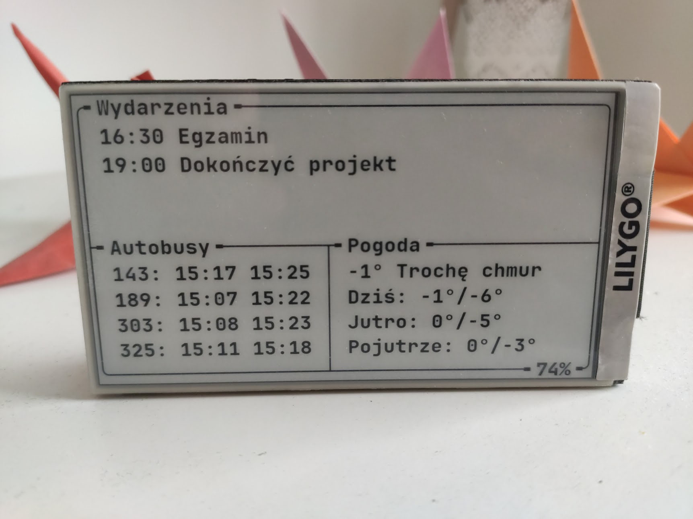

### eink-dashboard

This is a part of a hobby project to display a simple dashboard on an E-Ink display.

It is intended to run on [Lilygo T5-4.7](http://www.lilygo.cn/prod_view.aspx?TypeId=50061&Id=1384&FId=t3:50061:3) - an
E-Ink display with an integrated ESP32 microcontroller. With minor tweaks it should be able to run on similiar boards.

To make things simple, most of the logic is contained in a standalone server application - https://github.com/szwsck/eink-dashboard-server.
This program periodically downloads text representation of the data and displays it on the screen.